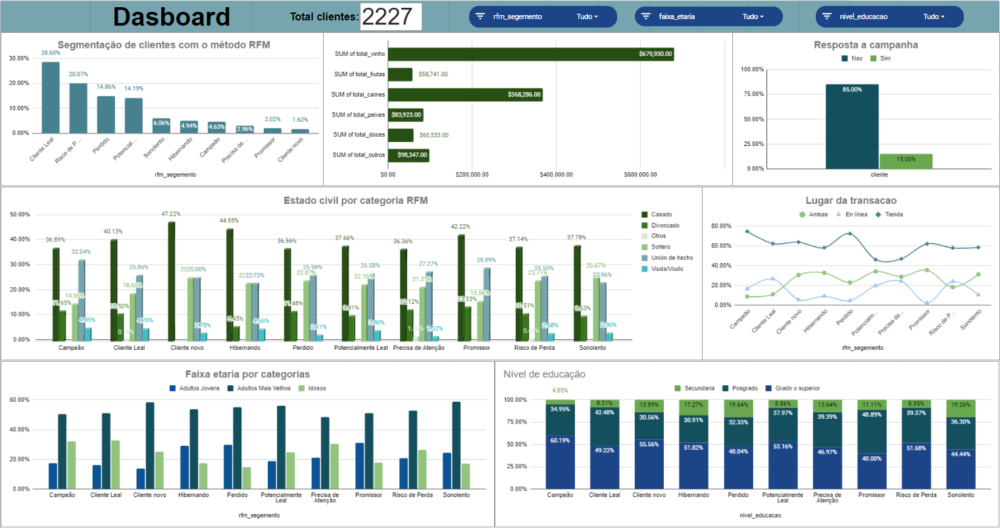

# 🚲 Segmentação "O mercado: BOA" 🚲

### **Table of Contents**
- [🚲 Segmentação "O mercado" 🚲](#-segmentacao-mercado-boa)
    - [**Table of Contents**](#table-of-contents)
  - [**Introdução**](#introdução)
  - [**Objetivo**](#objetivo)
  - [**Equipe**](#equipe)
  - [**Ferramentas e Tecnologias**](#ferramentas-e-tecnologias)
  - [**Processamento e análises**](#rocessamento-e-análises)
  - [**Resultados e Conclusões**](#Resultados-e-Conclusões)
  - [**Fontes de dados**](#fonte-de-dados)
  - [**Data Exploration and Analyisis**](#data-exploration-and-analyisis)
  - [**Prediction**](#prediction)
  - [**Results and conclusions**](#results-and-conclusions)
  - [**Google Sheets Dashboard**](#tableau-dashboard)

---

## **Introdução**

A loja “O Mercado” está num ambiente altamente competitivo e está experimentando mudanças significativas nas preferências dos consumidores. A fidelização do cliente tornou-se um desafio e a loja em questão está a procura de manter e aumentar o seu rendimento através de uma melhor compreensão de sua base de clientes e personalização de seas estratégias de marketing e retenção.

A estratégia escolhida pela loja é analisar suas vendas e segmentar a sua base de clientes usando a metodologia **RFM** (Recência,Frequência e Valor Monetário). Esta estratégia proporcionará a empresa uma importante vantagem competitiva, proporcionando uma profunda compreensão do comportamento de compra de seus clientes e permitirá tomar decisões estratégicas com base em dados.

---

## **Objetivo**

Aplicar a segmentação de clientes através do RFM para compreender o resultado da segmentação e em quais grupos a empresa pode concentrar esforços e/ou traçar estratégias de fidelização.

Esse objetivo é alcançado por meio dos seguintes subobjetivos:

- Identificar quem são esses clientes.
- Identificar se eles são casados, se têm filhos e qual é a idade deles.
- Identificar qual é o volume de vendas da empresa (em quantidade).
- Identificar uma relação entre os perfis dos clientes e os produtos que eles mais compram.

---

## **Equipe**

 - Marianela Ruiz
---

## **Ferramentas e Tecnologias**
- Ferramentas de anotações - Notion: https://www.notion.so/Laboratoria-480a7301ad034cd2b0710147b70d011d?pvs=4 
- ferramentas de visualização : Spreadsheets(Google Planilhas)
- Ferramenta do documentação e explicação do projeto - GitHub: https://github.com/marianelaruiz/SegementacaoRFM-mercado

---

## **Processamento e análises**
Descreva os processos de limpeza e exploração dos dados, as técnicas de análises aplicadas, etc

Exploração e análise de dados
Realizei várias etapas para preparar os dados para análise, incluindo:
1. processar e preparar o banco de dados: Nessa fase, os dados são preparados, o que envolve selecionar o subconjunto de dados a ser usado, limpar os dados para melhorar sua qualidade, adicionar novos dados para detectar possíveis problemas, como valores nulos, dados ausentes, dados duplicados etc. A partir de um banco de dados no Google Sheets, passamos por vários processos:
- Identificar e lidar com valores nulos
- Remova os clientes que não têm um identificador exclusivo.
- Remover clientes que eram duplicados, deixando-os apenas uma vez.
- Editar valores vazios.
- Crie novas variáveis, como idade, total de compras, faixa etária, número de compras na loja e linhas eletrônicas para facilitar o uso dos dados.
- Adicionar novas colunas, como segmento RFM, para categorizar os clientes e analisá-los de acordo com as categorias.
 - Removi os valores discrepantes, especialmente em relação à idade. Encontrei alguns outliers que provavelmente são erros de registro no banco de dados ou clientes que usam os dados de outras pessoas, então os removi para melhorar a precisão da análise.
- Os dados fora do escopo da análise foram identificados como clientes que têm transações após junho de 2022, já que o escopo da análise do estudo é do período de 30/07/2020 a 29/06/2022, então decidi remover esses clientes.
- Como nosso objetivo é agrupar os clientes por seu comportamento de compras, precisamos saber o número de dias desde que o cliente fez sua última compra (Recência), quantas vezes ele fez compras (Frequência) e quanto gastou em suas compras (Monetário). A segmentação RFM foi usada para obter essas variáveis. As variáveis obtidas serão usadas como insumos para a análise RFM, para determinar os grupos de clientes existentes na empresa.

Seguindo essas etapas, conseguimos garantir que nossos dados fossem confiáveis e bem preparados para a análise.

---

## **Resultados e Conclusões**
Apresenta os principais resultados obtidos a partir da análise de dados. 
Sumarize as conclusões tiradas do projeto, incluindo insights importantes, 
descobertas relevantes e possíveis recomendações.

---

## **Fontes de dados**
- Principal fonte de dados: https://drive.google.com/drive/folders/1forAVve6QP25VcWgZjA1G7r_WRP-SyEq

---

## **Data Exploration and Analyisis**

I conducted several steps to prepare the data for analysis, including:

- Treated null values by either removing them or imputing values where appropriate.
- Changed some metrics from meters (m) to kilometers (km) and from seconds (sec) to minutes (min) to make the data more user-friendly.
- Added specific columns that show the year, month, weekday, and hour of each rental to help with time-based analysis.
- Added "total_rentals" column based on "departures".
- Removed outliers, especially for distance and duration. I found some extreme values that were likely errors in the device that stores the bike metrics, so I removed them to improve the accuracy of the analysis.
- Dropped the column that shows the average speed in kilometers per hour because it had too many outliers and was not important for our analysis.
- Saved the clean data in a new file (clean_data.csv) that is now ready for prediction.
  
By taking these steps, we were able to ensure that our data was reliable and well-prepared for analysis.

---

## **Prediction**

In this project, one of my goals was to predict the total number of bike rentals without using a linear regression model. To do this, I first checked the distribution of the columns and realized that some were skewed, so I applied algorithmic transformation to these columns.

Next, I used an encoder to encode the categorical columns, and applied both the standard scaler and MinMax scaler to standardize the values and put them in the same range for the model.

After treating the data, I built the model. I printed out various metrics, such as R^2 score, mean squared error, root mean squared error, and mean absolute error. And visualized the performance of the model with a scatterplot.

Overall, the model performed well and provided accurate predictions for the total number of bike rentals.

---

## **Results and conclusions**

Based on the analysis performed, several interesting findings were observed.

- There is a correlation between the amount of rentals and the weather based on the degrees. The service is used more frequently when the weather is good, and temperatures are moderate. Secondly, the service is used more frequently between June and August, which are typically the months with better weather in Helsinki and Espoo.

- There are spikes in the total amount of rentals early in the morning when people usually want to get to work or to school and also in the afternoon when people come back from school and work. This indicates that the service is mainly used for commuting purposes.

- People travel more than 1M km per season with the bike system, which has a significant impact on how people move around the city in a more sustainable way.

- The busiest stations where there are more departures and returns. The busiest stations are Itämerentori, Kamppi, and Töölönlahdenkatu.

Additionally, the results indicate that the bike-sharing system has a significant impact on how people move around the city in a more sustainable way. The insights obtained from this analysis can be used to inform policy decisions related to transportation and urban planning in the region.

---

## ** Painel de controle (dashboard) no Google Sheets**

https://docs.google.com/spreadsheets/d/11CILRgakAJyvLFDcvDcnb_asMjqLUU8M35V0dQN5ItU/edit#gid=1023444668

