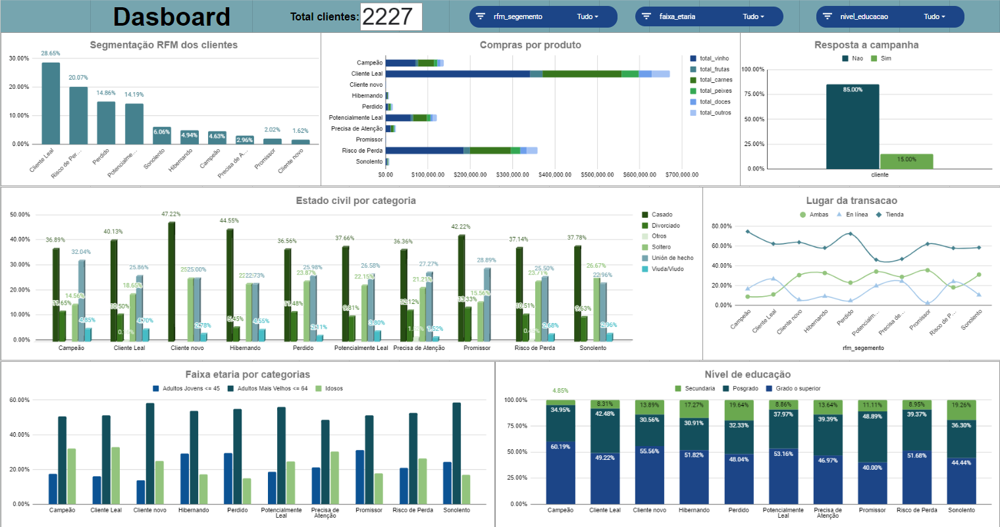

# 🥑 Segmentação "O mercado" 🥑

### **Table of Contents**
- [🥑 Segmentação "O mercado" 🥑](#-segmentacao-mercado)    
  - [**Introdução**](#introdução)
  - [**Objetivo**](#objetivo)
  - [**Equipe**](#equipe)
  - [**Ficha Técnica**](#ficha-tecnica)
  - [**Fontes de dados**](#fonte-de-dados)
  - [**Ferramentas e Tecnologias**](#ferramentas-e-tecnologias)
  - [**Processamento e análises**](#rocessamento-e-análises)
  - [**Resultados e Conclusões**](#Resultados-e-Conclusões) 
  - [**Google Sheets Dashboard**](#google-sheets-dashboard)
  -[**Referências:**](#referências)
   

---

## **Introdução**

A loja “O Mercado” está num ambiente altamente competitivo e está experimentando mudanças significativas nas preferências dos consumidores. A fidelização do cliente tornou-se um desafio e a loja em questão está a procura de manter e aumentar o seu rendimento através de uma melhor compreensão de sua base de clientes e personalização de seas estratégias de marketing e retenção.

A estratégia escolhida pela loja é analisar suas vendas e segmentar a sua base de clientes usando a metodologia **RFM** (Recência,Frequência e Valor Monetário). Esta estratégia proporcionará a empresa uma importante vantagem competitiva, proporcionando uma profunda compreensão do comportamento de compra de seus clientes e permitirá tomar decisões estratégicas com base em dados.

---

## **Objetivo**

Aplicar a segmentação de clientes através do RFM para compreender o resultado da segmentação e em quais grupos a empresa pode concentrar esforços e/ou traçar estratégias de fidelização.

Esse objetivo é alcançado por meio dos seguintes subobjetivos:

- Identificar quem são esses clientes.
- Identificar se eles são casados, se têm filhos e qual é a idade deles.
- Identificar qual é o volume de vendas da empresa (em quantidade).
- Identificar uma relação entre os perfis dos clientes e os produtos que eles mais compram.

---

## **Equipe**

 - Marianela Ruiz
---

## **Ficha Técnica**

 - https://scratch-bean-ca0.notion.site/Ficha-T-cnica-e97487a656274266bc9890a4092ab26a
---

## **Ferramentas e Tecnologias** 
- ferramentas de visualização : Spreadsheets(Google Planilhas) e google slides.
- Tecnologias: chat gpt https://chat.openai.com/
---

## **Fontes de dados**
- Principal fonte de dados: https://drive.google.com/drive/folders/1forAVve6QP25VcWgZjA1G7r_WRP-SyEq

---

## **Processamento e análises**
Realizei várias etapas para preparar os dados para análise, incluindo:

- Identificar e lidar com valores nulos. 
- Remover os clientes que não têm um identificador exclusivo. Na tabela de transações, foram encontrados 7 clientes com valores ausentes na variável id_cliente. Decidi eliminá-los porque minha base de identificação se baseia em identificar como chave o identificador de cada cliente.
- Remover clientes que eram duplicados en la tabela resumo_compras, deixando-os apenas uma vez.
- Editar valores vazios, da tabela de clientes, tinha 24 valores vazios na coluna salario_anual. Usei a medida de tendência central: mediana, para obter o valor médio do salário anual dos clientes. A mediana foi usada porque não é propensa a valores dispersos.
- Criar novas variáveis, como idade, total de compras, faixa etária, número de compras na loja e em línea para facilitar o uso dos dados.
 - Remover os valores discrepantes, especialmente em relação à idade. Encontrei alguns outliers que provavelmente são erros de registro no banco de dados ou clientes que usam os dados de outras pessoas, então os removi para melhorar a precisão da análise.
- Agrupar os clientes por seu comportamento de compras, precisamos saber o número de dias desde que o cliente fez sua última compra (Recência), quantas vezes ele fez compras (Frequência) e quanto gastou em suas compras (Monetário). A segmentação RFM foi usada para obter essas variáveis. As variáveis obtidas serão usadas como insumos para a análise RFM, para determinar os grupos de clientes existentes na empresa.

Seguindo essas etapas, consegui garantir que nossos dados fossem confiáveis e bem preparados para a análise.

---

## **Resultados e Conclusões**
 
Com base na análise realizada neste projeto, por meio da segmentação RFM, podemos conhecer o perfil dos clientes da empresa "O Mercado". Para isso, foi analisado o histórico de compras de cada cliente, decidiu-se segmentar os clientes por seu comportamento de compra, como os últimos dias de compra do cliente, a frequência de compras e quanto esse cliente gastou.

- A identificação dos perfis dos clientes revelou que na base de dados, a maior concentração de clientes está nas categorias de clientes fiéis (sendo a que apresenta a maior porcentagem), depois clientes em risco de perda, perdidos e potencialmente fiéis. Bem como clientes nos quais a empresa deve investir mais tempo e recursos. Embora a interpretação dos segmentos seja subjetiva, não há dúvida de que as informações obtidas podem ser de grande valia para a empresa e podem ser usadas para criar campanhas de marketing focadas nos segmentos identificados, que têm maior grau de aceitação.

- A análise revela que a taxa de resposta à campanha de marketing foi baixa, com apenas 15% dos clientes participando ativamente. Isso sugere áreas significativas para aprimoramento da estratégia de marketing, incluindo a personalização da mensagem e a diversificação dos canais de comunicação.
  
- A análise revela que o vinho é o produto mais popular entre os clientes, com uma proporção significativamente maior de vendas em comparação com outros produtos disponíveis. Essa constatação sugere oportunidades para capitalizar a demanda por vinho e adaptar as estratégias comerciais para maximizar a receita e a satisfação do cliente.

- A análise demográfica revela que a maioria dos clientes é casada e mais velhos. Isso sugere uma oportunidade de desenvolver estratégias de marketing e produtos que se concentrem nas necessidades e preferências desse grupo demográfico específico, o que poderia levar a uma maior retenção de clientes e maior receita.

---

## **Painel de controle (dashboard) no Google Sheets**

https://docs.google.com/spreadsheets/d/11CILRgakAJyvLFDcvDcnb_asMjqLUU8M35V0dQN5ItU/edit#gid=1023444668

---

## **Referências**
- https://medium.com/maxmilhas-tech/o-que-%C3%A9-rfm-e-como-aplic%C3%A1-lo-ao-seu-time-de-customer-service-b9c35817ed01
- https://www.divia.com.br/o-que-e-a-matriz-rfm-analise-rfm-e-como-usar-analise-rfm-para-segmentacao-de-clientes
- https://pt.wikipedia.org/wiki/RFM_(economia)
- https://www.techtarget.com/searchdatamanagement/definition/RFM-analysis